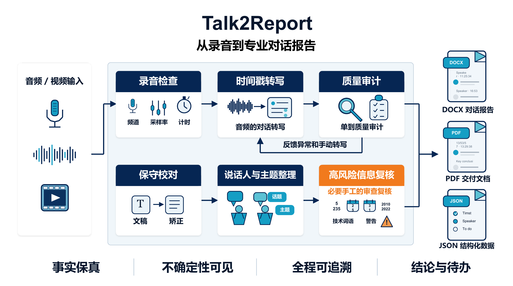

**English** · [简体中文](README.zh-CN.md)

# Talk2Report

**Fact-preserving audio-to-report transcription with conservative editing and auditable quality gates**

A public Codex skill for turning interviews, meetings, research sessions, podcasts, and other audio or video recordings into polished, timestamped dialogue documents.

[](talk2report/SKILL.md)
[](talk2report/scripts/audit_transcript.py)
[](talk2report/scripts/run_local_pipeline.ps1)
[](#output-package)

[Overview](#overview) · [Workflow](#workflow) · [Visual Summary](#visual-summary) · [Quick Start](#quick-start) · [Validation](#validation) · [Editorial Policy](#editorial-policy) · [Repository Map](#repository-map)

---

## Overview

This repository packages the [`Talk2Report`](talk2report/SKILL.md) Codex skill. It coordinates recording inspection, transcription, quality review, conservative proofreading, speaker labeling, topic organization, high-risk listening checks, and final document verification.

> [!IMPORTANT]
> Talk2Report is an orchestration and editorial skill. It uses the best transcription capability available in the working environment; it does not bundle a speech-recognition model or silently upload recordings to an external service.

| Goal | Implementation | Public evidence path |
|---|---|---|
| Produce a readable, traceable dialogue report | Timestamped turns, stable speaker labels, topic sections, conclusions, and explicit action items | [`SKILL.md`](talk2report/SKILL.md) |
| Preserve what was actually said | Immutable raw transcript, conservative editing rules, and visible uncertainty markers | [`editorial-policy.md`](talk2report/references/editorial-policy.md) |
| Keep handoff quality auditable | Duplicate checks, chronology checks, hallucination warnings, and a high-risk listening checklist | [`audit_transcript.py`](talk2report/scripts/audit_transcript.py) |
| Deliver professional artifacts | Defined DOCX/PDF/JSON structure plus visual inspection requirements | [`output-specification.md`](talk2report/references/output-specification.md) |

## Workflow

The skill treats the recording as the source of truth and moves through explicit quality gates:

| Stage | Role |
|---|---|
| `Inspect` | Probe duration, codec, sample rate, channels, and channel energy without changing the source file |
| `Transcribe` | Create timestamped raw segments with stable IDs and confidence data when available |
| `Audit` | Detect duplicates, suspicious repetition, long gaps, language shifts, and common ASR hallucinations |
| `Edit` | Correct punctuation, sentence boundaries, obvious recognition errors, and terminology conservatively |
| `Assign` | Apply stable names or functional speaker roles while keeping uncertain identities visible |
| `Organize` | Group chronological dialogue by real topic changes and separate conclusions from action items |
| `Verify` | Re-listen to names, numbers, dates, units, model identifiers, negations, and low-confidence passages |
| `Deliver` | Build the requested document and inspect layout, timestamps, headings, page breaks, and unresolved items |

## Visual Summary

[](docs/images/talk2report-overview.pdf)

[Open the full-size PNG](docs/images/talk2report-overview.png) · [Download the PDF](docs/images/talk2report-overview.pdf)

The raw transcript and quality evidence remain separate from the polished deliverable, so editorial changes never replace the underlying record.

## Output Package

When the available tools support them, the default deliverables are:

| Artifact | Purpose |
|---|---|
| `<source>_整理校对对话稿.docx` | Polished, user-facing dialogue document |
| `<source>_cleaned_transcript.json` | Structured edited dialogue with timestamps and provenance |
| `<source>_transcript_audit.json` | Structural checks, warnings, unresolved segments, and listening checklist |
| `<source>_整理校对对话稿.pdf` | Optional fixed-layout copy when requested |

The main document contains metadata, timestamped dialogue grouped by topic, confirmed conclusions, explicit action items, and a review section when uncertainty remains.

## Quick Start

Clone the repository:

```bash
git clone https://github.com/rudykon/Talk2Report.git
cd Talk2Report
```

Install the skill on macOS or Linux:

```bash
mkdir -p ~/.codex/skills
cp -R talk2report ~/.codex/skills/
```

Install it on Windows PowerShell:

```powershell
New-Item -ItemType Directory -Force "$HOME\.codex\skills" | Out-Null
Copy-Item -Recurse -Force ".\talk2report" "$HOME\.codex\skills\"
```

Invoke it in Codex:

```text
Use $talk2report to turn this recording into a polished,
timestamped dialogue document with speaker labels, conclusions, and action items.
```

If a compatible local `audio_transcript_agent` project is available, the bundled wrapper can discover and run its resumable pipeline:

```powershell
.\talk2report\scripts\run_local_pipeline.ps1 `
  -AudioPath ".\recording.mp3" `
  -ProbeOnly
```

The skill will otherwise use an available transcription capability and will report clearly when no engine is available.

## Validation

Audit a structured cleaned transcript before handoff:

```bash
python talk2report/scripts/audit_transcript.py \
  cleaned_transcript.json \
  --output transcript_audit.json
```

The audit checks:

- missing text, missing speakers, duplicate IDs, and chronological order;
- consecutive and global repeated segments;
- unresolved speaker or terminology markers;
- Unicode replacement characters and common hallucination phrases;
- high-risk passages containing numbers, dates, units, negations, deadlines, or responsibility assignments.

An audit result is a review aid, not a substitute for listening to the recording.

## Editorial Policy

| The skill preserves | The skill never invents |
|---|---|
| Facts, uncertainty, emphasis, negation, restrictions, disagreement, and interpersonal intent | Missing words added only to make a sentence smoother |
| Names and terminology supported by audio or user-provided context | Names, product terms, diagnoses, quantities, dates, owners, or deadlines based on plausibility alone |
| Speaker corrections and meaningful hesitation | Decisions, commitments, or causal explanations not supported by the recording |
| Explicit markers such as `〔听不清，00:12:34〕` | False certainty when audio, terminology, or speaker identity remains unresolved |

See the complete [`editorial-policy.md`](talk2report/references/editorial-policy.md) for the source-of-truth order, allowed edits, forbidden edits, uncertainty notation, speaker policy, and high-risk review rules.

## Repository Map

| Path | Purpose |
|---|---|
| [`talk2report/SKILL.md`](talk2report/SKILL.md) | Core orchestration workflow and completion standard |
| [`talk2report/agents/openai.yaml`](talk2report/agents/openai.yaml) | Codex skill display metadata and default invocation prompt |
| [`talk2report/references/editorial-policy.md`](talk2report/references/editorial-policy.md) | Fact-preserving proofreading and uncertainty policy |
| [`talk2report/references/output-specification.md`](talk2report/references/output-specification.md) | Deliverable names, document structure, JSON shape, and handoff note |
| [`talk2report/scripts/audit_transcript.py`](talk2report/scripts/audit_transcript.py) | Deterministic structural and review audit for cleaned transcript JSON |
| [`talk2report/scripts/run_local_pipeline.ps1`](talk2report/scripts/run_local_pipeline.ps1) | Discovery wrapper for a compatible local resumable transcription pipeline |
